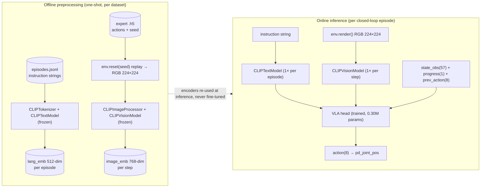

# Encoder Pipeline — CLIP text & vision in the VLA policy

이 문서는 **language instruction 과 RGB 이미지가 정책에 어떻게 들어가는지**를 코드와 차원 흐름으로 정리한다. 본 PoC 의 VLA 정책은 별도의 vision-language backbone 을 학습하지 않고 **OpenAI CLIP ViT-B/32 한 모델의 text·vision 두 타워를 모두 frozen 으로 재사용**하며, 학습은 작은 projection layer + MLP trunk + 보조 분류 head 만 한다.

핵심 출처: [scripts/m4_add_instruction_embeddings.py](../scripts/m4_add_instruction_embeddings.py), [scripts/m6_add_image_embeddings.py](../scripts/m6_add_image_embeddings.py), [scripts/m6_train_vla_lang_aux.py](../scripts/m6_train_vla_lang_aux.py).

---

## 1. Backbone 선택 — 왜 CLIP ViT-B/32 한 모델이었나

- **단일 사전학습 모델로 text·vision 양쪽 임베딩을 모두 얻기 위해서.** `openai/clip-vit-base-patch32` 는 두 타워가 동일한 contrastive 학습에서 함께 정렬되도록 학습된 모델이라 별도 vision-language alignment 작업 없이 두 임베딩을 같은 정책 입력에 concat 할 수 있다.
- 컴퓨트 제약 (단일 RTX 3060, ~300 episode/task). **두 타워 모두 frozen 으로 두면 forward-only**라서, 학습은 사실상 작은 MLP 한 개를 돌리는 비용밖에 들지 않는다.
- ViT-B/32: 12-layer Transformer, hidden 768 (vision) / 512 (text), patch size 32, 입력 224×224. 본 PoC 의 ManiSkill `env.render()` 해상도를 그대로 224 로 맞춰 처리 부담을 최소화.

---

## 2. Language instruction 처리

### 코드 위치
- 전처리 스크립트: [scripts/m4_add_instruction_embeddings.py](../scripts/m4_add_instruction_embeddings.py)
- 정책 측 정의: [scripts/m6_train_vla_lang_aux.py](../scripts/m6_train_vla_lang_aux.py) (`lang_proj`, `task_head`)
- 추론 측 인코딩: [scripts/m6_eval_closedloop_vla.py](../scripts/m6_eval_closedloop_vla.py) (episode 시작 시 1회)

### 흐름

```text
instruction string ("Pick the bolt-like part and place it at the left fixture.")
        │
        ▼
CLIPTokenizer.from_pretrained("openai/clip-vit-base-patch32")
   tokenizer(batch, padding=True, truncation=True, return_tensors="pt")
        │
        ▼
CLIPTextModel.from_pretrained("openai/clip-vit-base-patch32").eval()    ← FROZEN (63.7M)
   out.pooler_output                                      → lang_emb  (512-dim)
        │
        ▼
nn.Linear(512, 64) + ReLU                                ← TRAINED  (32,832 params)
        │
        ▼
lang_feat (64-dim)
        │       └────────────────────────────────────────┐
        │                                                │
        ▼                                                ▼
  concat with obs(66) and image_feat(128)        task_head: nn.Linear(64, 3)    ← TRAINED (195)
                                                  auxiliary CrossEntropy on task_id
                                                  (M5.1+: makes lang_feat task-separable)
```

### 핵심 구현 디테일

- **임베딩은 episode 단위로 사전 계산해서 데이터셋에 캐시.** `m4_add_instruction_embeddings.py` 가 `outputs/<dataset>/episodes/*.npz` 에 `lang_emb` 필드를 추가한다. 학습 중에 CLIP forward 호출은 **0회**.
- 추론 시에는 `--instruction` 으로 받은 문자열을 episode 시작 시 한 번만 인코딩하고 모든 step 에 동일 임베딩을 재사용 — 한 episode 내 instruction 은 변하지 않는다.
- CLIP `pooler_output` (12-layer Transformer 의 `[CLS]`/`EOS` 토큰 임베딩에 LayerNorm 적용한 결과) 을 그대로 정책 입력으로 사용. attention pooling 이나 last_hidden_state mean pooling 은 시도하지 않았다.
- **M5.1 의 핵심 트릭 (auxiliary task-classification loss).** `task_head = nn.Linear(64, 3)` 를 `lang_feat` 위에 얹고 `CE(task_logits, task_id)` 를 BC 손실과 동시에 (`aux_weight=1.0`) 최적화. 이 손실이 없는 M5 에서는 `lang_feat` 의 정보가 정책에 사용되지 않고 dummy 로 남았던 반면, 손실을 더하면 `val_task_acc=1.0` 으로 수렴하고 swap matrix 에서 instruction-following 이 정량적으로 확인된다 (PickCube grasp swap 0.10 → 0.00). 자세한 내용은 [docs/m5_1_aux_loss.md](m5_1_aux_loss.md).

---

## 3. Vision input 처리

### 코드 위치
- 전처리: [scripts/m6_add_image_embeddings.py](../scripts/m6_add_image_embeddings.py)
- 정책: [scripts/m6_train_vla_lang_aux.py](../scripts/m6_train_vla_lang_aux.py) (`image_proj`)
- 추론: [scripts/m6_eval_closedloop_vla.py](../scripts/m6_eval_closedloop_vla.py) (매 step 인코딩)

### 흐름

```text
env.render() RGB frame
        │
        ▼
CLIPImageProcessor.from_pretrained("openai/clip-vit-base-patch32")
   inputs = processor(images=imgs, return_tensors="pt")   ← resize to 224, normalize
        │
        ▼
CLIPVisionModel.from_pretrained("openai/clip-vit-base-patch32").eval()  ← FROZEN (87.8M)
   out.pooler_output                                      → image_emb (768-dim)
        │
        ▼
nn.Linear(768, 128) + ReLU                               ← TRAINED (98,432 params)
        │
        ▼
image_feat (128-dim) → concat with obs(66) and lang_feat(64)
```

### 핵심 구현 디테일

- **임베딩 사전 계산 — deterministic replay.** 학습용 데이터셋의 각 expert 궤적에 대해, **저장된 `episode_seed` 로 `env.reset(seed)` 후 expert action 을 그대로 replay** 하면서 매 step `env.render()` 의 결과를 CLIP vision tower 로 인코딩한다. 이렇게 하면 학습 데이터셋이 **deterministic 한 per-step 768-dim 임베딩** 을 갖게 되고, 학습 시 CLIP forward 호출이 **0회**. (단, 데이터셋 만들 때 한 번은 모든 episode 를 sim 으로 다시 굴려야 한다 — 이게 시간을 가장 많이 잡아먹는다.)
- **Resolution 은 224×224 로 고정.** CLIP-B/32 의 native input 크기이며, ManiSkill `render_mode="rgb_array"` 에서 `--render-resolution 224` 로 직접 매칭.
- **추론 시에는 매 step 마다 CLIP vision forward 1회.** instruction 인코딩과 달리 image 는 매 step 다르므로 캐시 불가. RTX 3060 기준 1 step 인코딩은 ~10 ms 수준이라 closed-loop 평가 throughput 의 병목은 아니다.
- 정책 입력은 `pooler_output` 만 사용. patch-level token (`last_hidden_state`) 이나 별도 attention pooling 은 시도하지 않았다.

---

## 4. 정책 입력 결합

[m6_train_vla_lang_aux.py:221-231](../scripts/m6_train_vla_lang_aux.py#L221-L231)

```python
def forward_with_aux(self, obs, lang_emb, image_emb):
    lang_p  = F.relu(self.lang_proj(lang_emb))    # 512 -> 64
    image_p = F.relu(self.image_proj(image_emb))  # 768 -> 128
    x = torch.cat([obs, lang_p, image_p], dim=-1) # 66 + 64 + 128 = 258
    action = self.net(x)                          # MLP trunk -> 8
    task_logits = self.task_head(lang_p)          # aux head on lang_p only -> 3
    return action, task_logits
```

차원 흐름:

```text
state_obs(57) + progress(1) + prev_action(8)     →   obs(66)         ─┐
instruction → CLIPTextModel.pooler → lang_emb(512) → lang_proj → lang_feat(64) ─┼─→ concat(258)
                                                                 └─ task_head → task_logits(3) [aux CE]
env.render → CLIPVisionModel.pooler → image_emb(768) → image_proj → image_feat(128) ─┘
                                                                       │
                                                                       ▼
                                                              MLP trunk (258→256→256→128→8)
                                                                       │
                                                                       ▼
                                                                    action(8)
```

---

## 5. Parameter accounting

(hidden_dims = [256, 256, 128] · 본 PoC 의 M6/M8 기준)

| 부품 | 역할 | params | 학습? |
| -- | -- | --: | -- |
| CLIPTextModel | 명령어 → 512-dim 임베딩 | **63,700,000** | ❌ frozen |
| CLIPVisionModel | RGB(224×224) → 768-dim 임베딩 | **87,800,000** | ❌ frozen |
| `lang_proj` Linear(512→64) | 명령어 projection | 32,832 | ✅ 학습 |
| `image_proj` Linear(768→128) | 이미지 projection | 98,432 | ✅ 학습 |
| `task_head` Linear(64→3) | 보조 task 분류 head (M5.1+) | 195 | ✅ 학습 |
| MLP trunk + action head | 258→256→256→128→8 | 166,024 | ✅ 학습 |
| **합계** |  |  |  |
| Frozen (CLIP) |  | **151,500,000** (≈151.5 M) |  |
| Trained (this project) |  | **297,483** (≈0.30 M) |  |
| Trained / Total |  | **0.20%** |  |

확인된 출처: `runs/m8b_bc_per_task_head_v0/metrics.json` 의 `num_params_M = 0.299547` (per-task head 구조로 약간 더 큰 값). 시각화: [docs/figures/architecture/frozen_vs_trained_params.png](figures/architecture/frozen_vs_trained_params.png).

이 비율이 의미하는 바:
- 본 PoC 가 입증하는 것은 **VLA stack 의 각 층을 어떻게 조립하고 검증하는가**이지 foundation 모델 학습 자체가 아니다. 학습되는 부분이 0.20% 라는 점이 그 framing 을 정량적으로 받쳐준다.
- 다음 단계로 자연스럽게 연결되는 것이 **trunk capacity 자체를 키우는 fine-tune** (OpenVLA / Octo LoRA, M9b) — 현재 0.30 M trained head 가 모든 task 의 capacity-sharing trade-off 를 다 받아내고 있기 때문.

---

## 6. Diagrams

이 문서를 그림으로 압축한 두 장:

### (a) Offline preprocessing vs Online inference

`docs/figures/architecture/encoder_pipeline.mmd` — episode-단위 text 캐시와 step-단위 vision 캐시가 어떻게 학습/추론에 사용되는지.



### (b) 차원 표기된 정책 구조

`docs/figures/architecture/policy_shapes.mmd` — 각 텐서의 차원과 부품 별 파라미터 수.

### (c) Frozen vs Trained 파라미터 비율

`docs/figures/architecture/frozen_vs_trained_params.png` — log scale 좌측에서 151.5M vs 0.30M, 우측에서 부품별 분해.

---

## 7. 트레이드오프 한 줄 정리

비전 추가 (M6) 는 PickCube grasp 를 6.7% → 30% 로 끌어올렸지만, **instruction 을 swap 했을 때 grasp 가 0% → 7~10% 로 새어 나오는 vision-vs-language shortcut tension** 도 관측되었다. 두 강한 modality 가 같은 deterministic BC head 에 입력될 때 gradient descent 가 둘 중 더 쉬운 쪽 (현재는 vision) 으로 흐른다는 표준적 현상이며, M9e (contrastive 정렬 손실) 후보의 동기가 된다. 자세한 분석은 [docs/m6_vla.md](m6_vla.md).
