# Portfolio Figures

포트폴리오/지원서/슬라이드용 그림 모음. 모든 수치는 `runs/*/closedloop_summary.json` 및 `runs/*/training_curve.csv` 의 raw 값을 그대로 사용했고, 재생성은 한 줄로 가능하다.

## 재생성 명령

```bash
# matplotlib 가 들어 있는 컨테이너 안에서
docker exec manufacturing_vla_poc \
  python3 /workspace/manufacturing-vla-poc/scripts/make_portfolio_figures.py
```

Mermaid 다이어그램은 GitHub 가 자동 렌더하며, 별도 도구가 필요하지 않다.

GIF 재생성:

```bash
# 예: M7.1 PushCube success
ffmpeg -y -i runs/m7_diffusion_v1/debug_video_x5/PushCube-v1_seed_3000/0.mp4 \
  -vf "fps=15,scale=480:-1:flags=lanczos,split[s0][s1];[s0]palettegen=max_colors=128[p];[s1][p]paletteuse" \
  -loop 0 docs/figures/gifs/m7_pushcube_success_seed3000.gif
```

---

## Architecture diagrams (Mermaid · GitHub 자동 렌더)

| 파일 | 내용 |
| -- | -- |
| [architecture/pipeline.mmd](architecture/pipeline.mmd) | M0 → M8 전체 마일스톤 파이프라인 |
| [architecture/vla_policy.mmd](architecture/vla_policy.mmd) | VLA 정책 구조 (state + CLIP-text + CLIP-vision → trunk → action head + aux task head) |
| [architecture/encoder_pipeline.mmd](architecture/encoder_pipeline.mmd) | Offline preprocessing(CLIP text/vision 캐시) vs online inference 데이터 흐름 |
| [architecture/policy_shapes.mmd](architecture/policy_shapes.mmd) | 정책 입력/출력 차원 + 부품별 파라미터 수 표기 |
| [architecture/eval_protocol.mmd](architecture/eval_protocol.mmd) | closed-loop swap matrix 평가 프로토콜 |

**Frozen vs Trained 파라미터 비교 (PNG)** — [architecture/frozen_vs_trained_params.png](architecture/frozen_vs_trained_params.png) — CLIP ViT-B/32 frozen 151.5 M vs 학습 head 0.30 M (= 0.20%). 본 PoC 가 foundation 학습이 아니라 applied VLA workflow 임을 한눈에 보여주는 그림. 자세한 흐름은 [encoder_pipeline.md](../encoder_pipeline.md).

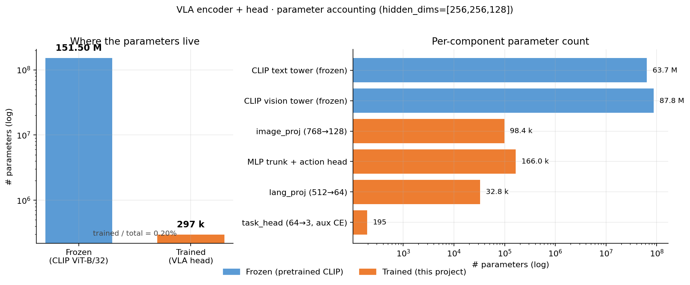

### Pipeline overview

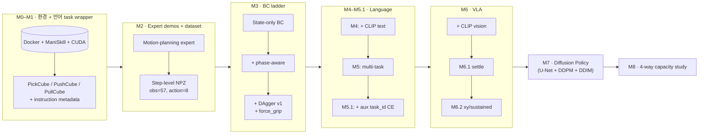

### VLA policy structure

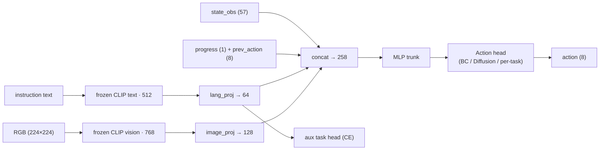

---

## Curves (학습 그래프)

### Fig 1 · Language conditioning open-loop validation MSE
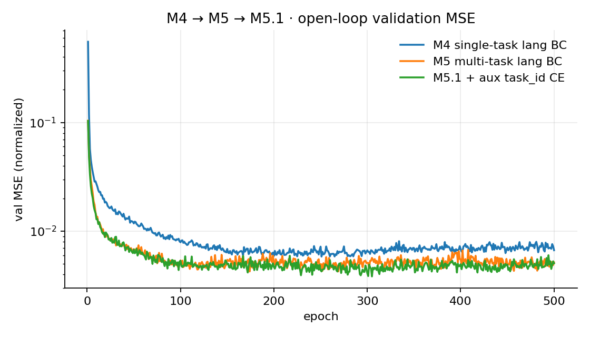

→ M5/M5.1 이 M4 보다 낮은 val MSE 에 안착. **숫자만 보면 잘 학습된 것처럼 보이지만, closed-loop swap matrix 가 진짜 진단 도구**임을 보여주는 그림.

### Fig 2 · M5.1 aux task classification accuracy
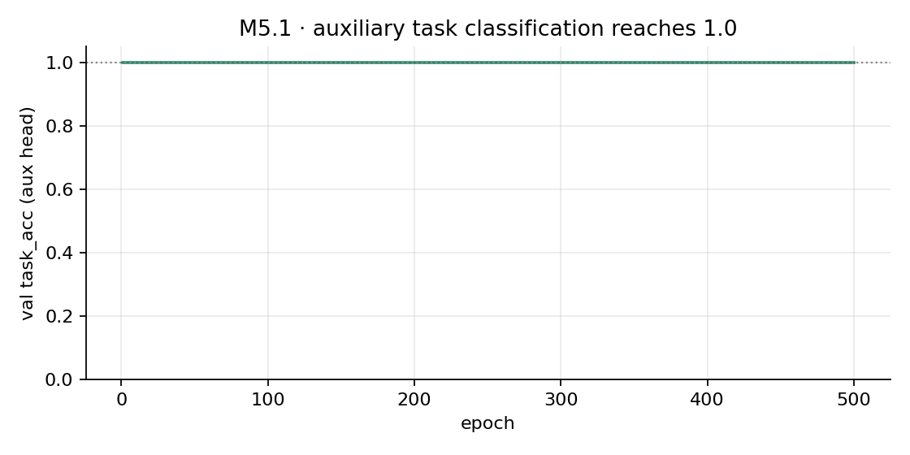

→ `lang_proj` 가 task 별로 선형 분리 가능해진 상태(`val_task_acc=1.0`). BC head 가 instruction 을 무시할 수 없게 만든 보조 손실의 효과.

### Fig 3 · Diffusion Policy validation eps-MSE (v0 vs v1)
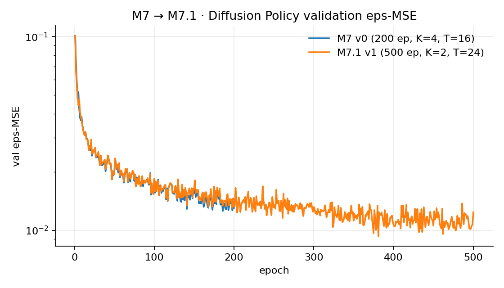

→ M7.1 (500 epoch, K=2, T=24) 가 v0 대비 eps-MSE 26% 감소.

---

## Comparison (변형별 성능)

### Fig 4 · M3 line — PickCube BC 진화
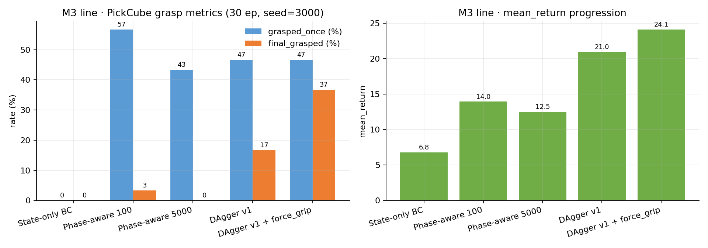

→ phase signals 가 가장 큰 단일 개선 (grasped_once 0 → 57%). force_grip heuristic 이 final_grasped 를 17% → 37% 로 거의 두 배.

### Fig 5 · M8 — 4-way 정책 비교 (matched-instruction)
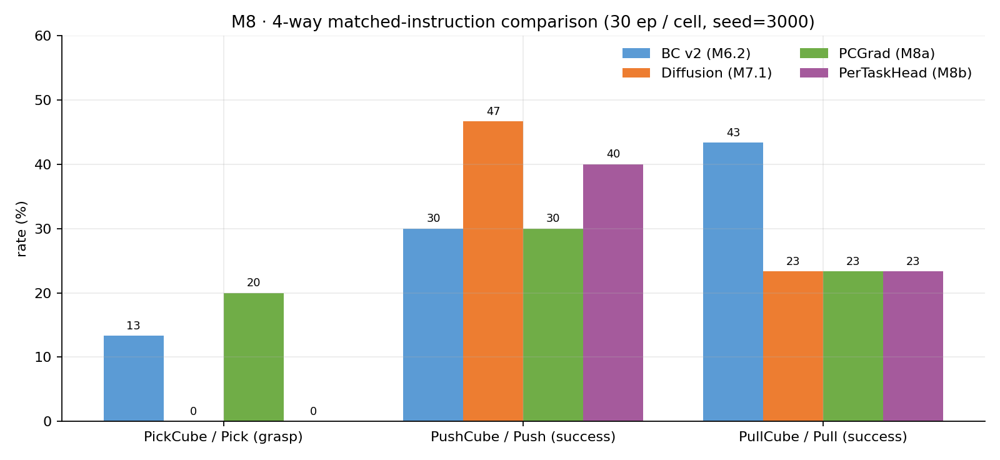

→ **각 모델이 서로 다른 task 에서 best 인 capacity-sharing trade-off**. Diffusion=PushCube, BC v2=PullCube, PCGrad=PickCube grasp.

### Fig 6 · Swap matrix heatmap (instruction following)
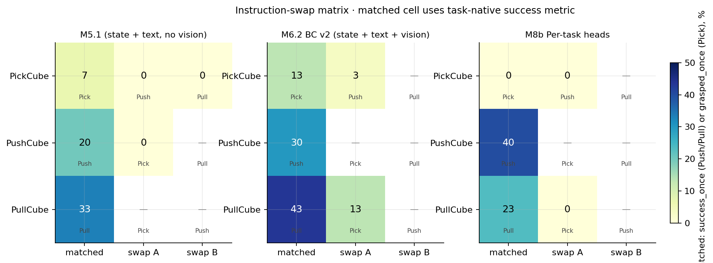

→ M5.1 / M6.2 / M8b 가 swap instruction 을 따르는지 시각화. matched cell 에서는 task-native success(PickCube grasp / Push·Pull success), swap cell 에서는 instruction obedience(0 일수록 명시 instruction 따름).

### Fig 7 · Capacity radar
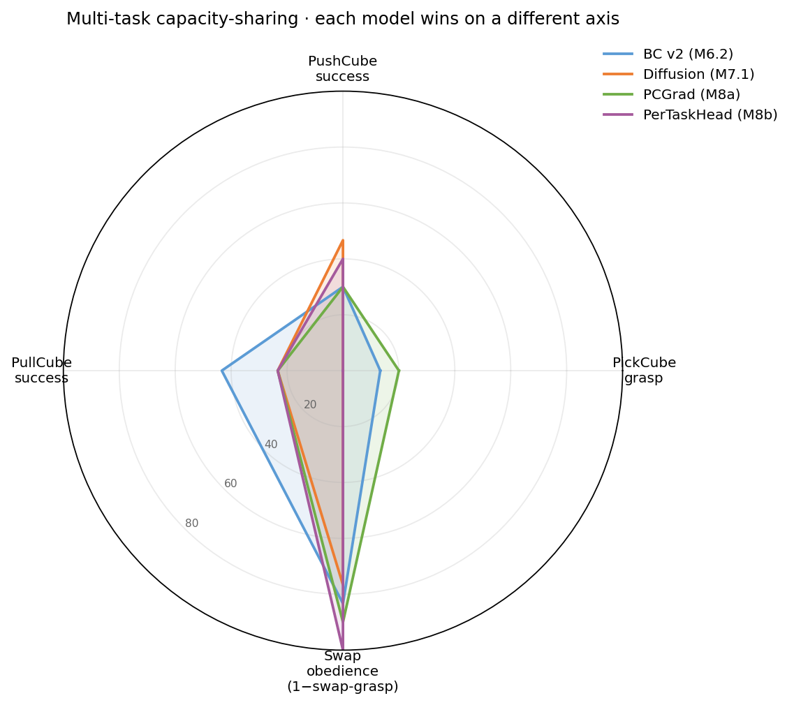

→ 같은 trade-off 패턴을 한 장으로 압축. 각 모델은 어느 한 축에서 우위, 다른 축에서 열위.

### Fig 8 · M6 evolution (M5.1 → M6 → M6.1 → M6.2)
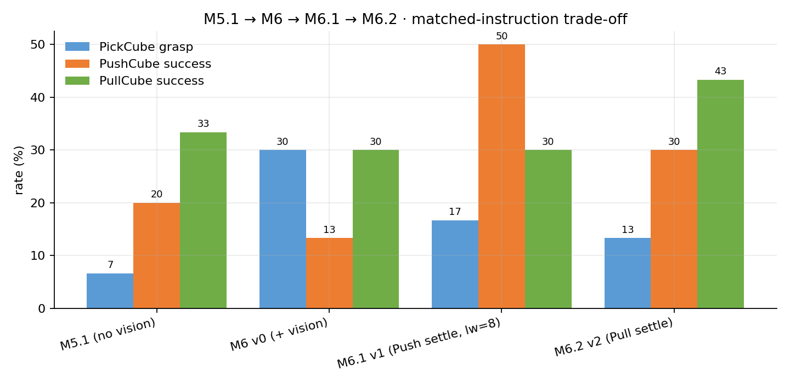

→ 비전 추가 (M6 v0) 가 PickCube grasp 7% → 30%, expert-side settle solver (M6.1) 가 PushCube success 13% → 50%, M6.2 가 PullCube success 30% → 43%.

---

## Demo GIFs

| GIF | 모델 | 환경 / 시드 | 한 줄 설명 |
| -- | -- | -- | -- |
| 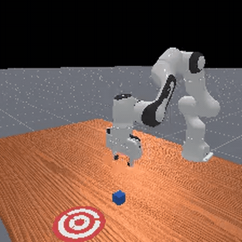 | M7.1 Diffusion | PushCube, seed 3000 | Diffusion 정책이 cube 를 goal_region 으로 밀어넣는 success rollout (matched success 46.7%) |
| 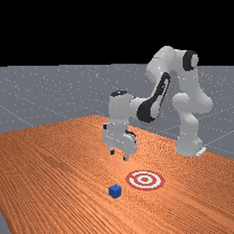 | M7.1 Diffusion | PullCube, seed 3000 | Diffusion 정책의 PullCube success rollout |
| 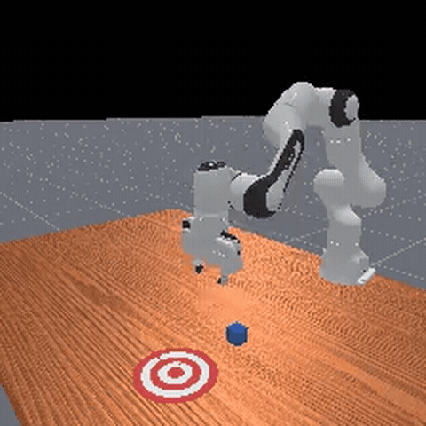 | M6.1 VLA v1 | PushCube, seed 3029 | settle solver + `late_weight=8` 적용 후 cube 가 goal_region 중심부까지 진입 |
| 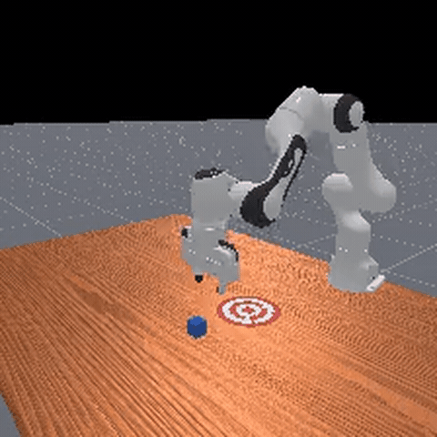 | M6.2 VLA v2 | PullCube, seed 3024 | PullCube settle solver 적용 후 정책이 cube 를 끌어와 안착 |
| 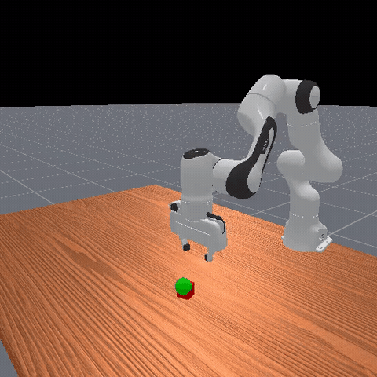 | M6 v0 VLA | PickCube, seed 3019 | 비전 추가로 grasp 률이 7%→30% 로 회복된 시점의 rollout |
| 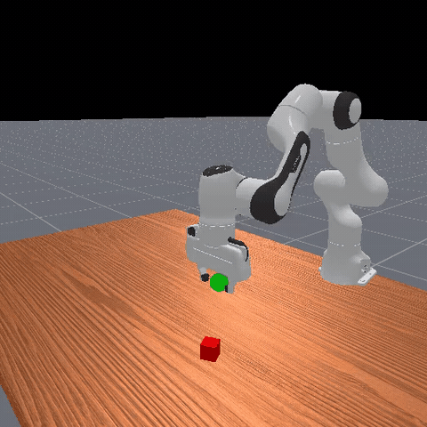 | M3 state-only BC | PickCube, seed 3000 | 실패 사례: state-only BC 가 cube 를 밀어내며 실패. M3.4 phase signal 도입의 동기 |
| 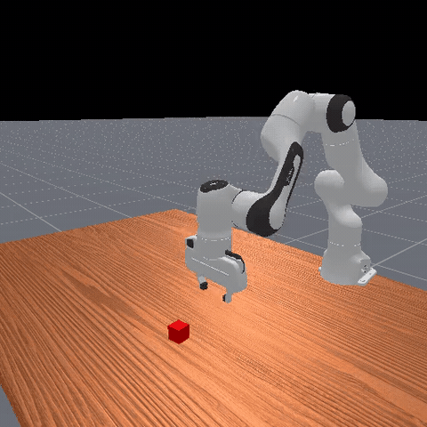 | M3 DAgger v1 | PickCube, seed 3021 | DAgger v1 정책이 cube 를 들어 올린 뒤 goal 근방까지 이동 (placement 직전) |

GIF 는 4초 클립, 480×480, 15 fps 다. 원본 mp4 는 각 `runs/.../debug_video*/*/0.mp4`.

---

## 슬라이드 권장 구성 (1~2장 압축)

**1장 압축 (1 slide)**
- 좌측: Fig 7 (Capacity radar) — 한 장으로 4-way trade-off 가 모두 보임
- 우측: Demo GIF 2장 (M7 PushCube success + M3 state-only failure) — 성공/실패 대비

**2장 압축 (2 slide)**

| Slide A — Pipeline & Architecture | Slide B — Results |
| -- | -- |
| Pipeline mermaid | Fig 4 (M3 BC progression) |
| VLA policy mermaid | Fig 5 (M8 4-way bars) |
| Eval protocol mermaid | Fig 7 (Capacity radar) |
|  | Demo GIF × 2 |

---

## 출처/재현 가능성

모든 plot 의 raw 데이터:
- 학습 곡선: `runs/{m4_bc_lang_v0,m5_bc_lang_multitask_v0,m5_1_bc_lang_multitask_aux_v0,m7_diffusion_v{0,1}}/training_curve.csv`
- 성능 metric: `runs/{m3_*,m4_*,m5_*,m6_*,m7_*,m8a_*,m8b_*}/<eval_dir>/closedloop_summary.json`
- 영상: `runs/<run>/debug_video*/<env>_seed_<seed>/0.mp4`

생성 스크립트: [scripts/make_portfolio_figures.py](../../scripts/make_portfolio_figures.py)
